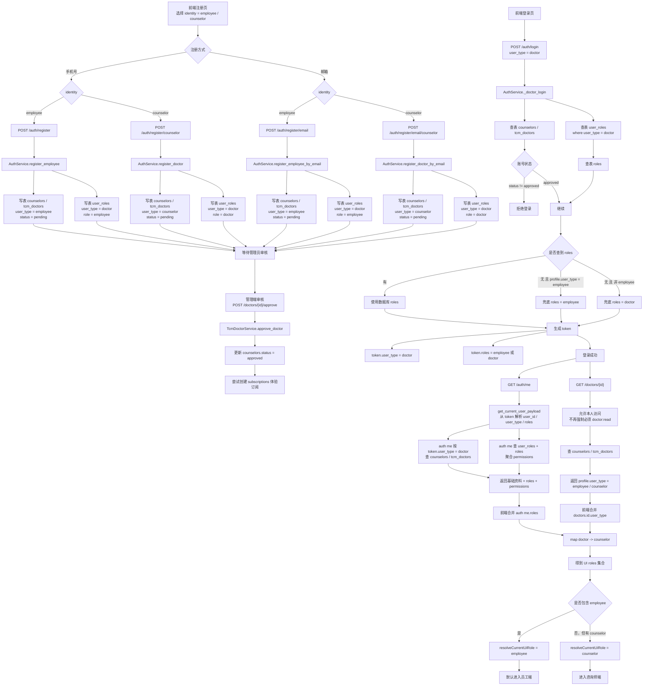

```mermaid
flowchart TD
    A["前端注册页<br/>选择 identity = employee / counselor"]

    A --> B{"注册方式"}
    B -->|"手机号"| C{"identity"}
    B -->|"邮箱"| D{"identity"}

    C -->|"employee"| E["POST /auth/register"]
    C -->|"counselor"| F["POST /auth/register/counselor"]

    D -->|"employee"| G["POST /auth/register/email"]
    D -->|"counselor"| H["POST /auth/register/email/counselor"]

    E --> I["AuthService.register_employee"]
    G --> J["AuthService.register_employee_by_email"]
    F --> K["AuthService.register_doctor"]
    H --> L["AuthService.register_doctor_by_email"]

    I --> M["写表 counselors / tcm_doctors<br/>user_type = employee<br/>status = pending"]
    J --> N["写表 counselors / tcm_doctors<br/>user_type = employee<br/>status = pending"]
    K --> O["写表 counselors / tcm_doctors<br/>user_type = counselor<br/>status = pending"]
    L --> P["写表 counselors / tcm_doctors<br/>user_type = counselor<br/>status = pending"]

    I --> Q["写表 user_roles<br/>user_type = doctor<br/>role = employee"]
    J --> R["写表 user_roles<br/>user_type = doctor<br/>role = employee"]
    K --> S["写表 user_roles<br/>user_type = doctor<br/>role = doctor"]
    L --> T["写表 user_roles<br/>user_type = doctor<br/>role = doctor"]

    M --> U["等待管理员审核"]
    N --> U
    O --> U
    P --> U
    Q --> U
    R --> U
    S --> U
    T --> U

    U --> V["管理端审核<br/>POST /doctors/{id}/approve"]
    V --> W["TcmDoctorService.approve_doctor"]
    W --> X["更新 counselors.status = approved"]
    X --> Y["尝试创建 subscriptions 体验订阅"]

    Z["前端登录页"] --> A1["POST /auth/login<br/>user_type = doctor"]

    A1 --> B1["AuthService._doctor_login"]
    B1 --> C1["查表 counselors / tcm_doctors"]
    B1 --> D1["查表 user_roles<br/>where user_type = doctor"]
    D1 --> E1["查表 roles"]

    C1 --> F1{"账号状态"}
    F1 -->|"status != approved"| G1["拒绝登录"]
    F1 -->|"approved"| H1["继续"]

    E1 --> H1
    H1 --> I1{"是否查到 roles"}
    I1 -->|"有"| J1["使用数据库 roles"]
    I1 -->|"无 且 profile.user_type = employee"| K1["兜底 roles = employee"]
    I1 -->|"无 且 非 employee"| L1["兜底 roles = doctor"]

    J1 --> M1["生成 token"]
    K1 --> M1
    L1 --> M1

    M1 --> N1["token.user_type = doctor"]
    M1 --> O1["token.roles = employee 或 doctor"]
    M1 --> P1["登录成功"]

    P1 --> Q1["GET /auth/me"]
    Q1 --> R1["get_current_user_payload<br/>从 token 解析 user_id / user_type / roles"]
    R1 --> S1["auth me 按 token.user_type = doctor<br/>查 counselors / tcm_doctors"]
    R1 --> T1["auth me 查 user_roles + roles<br/>聚合 permissions"]
    S1 --> U1["返回基础资料 + roles + permissions"]
    T1 --> U1

    P1 --> V1["GET /doctors/{id}"]
    V1 --> W1["允许本人访问<br/>不再强制必须 doctor:read"]
    W1 --> X1["查 counselors / tcm_doctors"]
    X1 --> Y1["返回 profile.user_type = employee / counselor"]

    U1 --> Z1["前端合并 auth me.roles"]
    Y1 --> A2["前端合并 doctors.id.user_type"]
    Z1 --> B2["map doctor -> counselor"]
    A2 --> B2
    B2 --> C2["得到 UI roles 集合"]

    C2 --> D2{"是否包含 employee"}
    D2 -->|"是"| E2["resolveCurrentUiRole = employee"]
    D2 -->|"否，但有 counselor"| F2["resolveCurrentUiRole = counselor"]
    E2 --> G2["默认进入员工端"]
    F2 --> H2["进入咨询师端"]
  
```