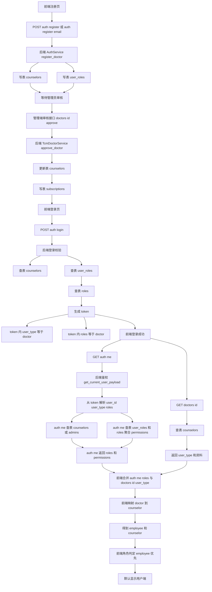

```mermaid
flowchart TD
    A[前端注册页]
    B[POST auth register 或 auth register email]
    C[后端 AuthService register_doctor]
    D[写表 counselors]
    E[写表 user_roles]
    F[等待管理员审核]
    G[管理端审核接口 doctors id approve]
    H[后端 TcmDoctorService approve_doctor]
    I[更新表 counselors]
    J[写表 subscriptions]
    K[前端登录页]
    L[POST auth login]
    M[后端登录校验]
    N[查表 counselors]
    O[查表 user_roles]
    P[查表 roles]
    Q[生成 token]
    R[token 内 user_type 等于 doctor]
    S[token 内 roles 等于 doctor]
    T[前端登录成功]
    U[GET auth me]
    V[后端鉴权 get_current_user_payload]
    W[从 token 解析 user_id user_type roles]
    X[auth me 查表 counselors 或 admins]
    Y[auth me 查表 user_roles 和 roles 聚合 permissions]
    Z[auth me 返回 roles 和 permissions]
    A1[GET doctors id]
    B1[查表 counselors]
    C1[返回 user_type 和资料]
    D1[前端合并 auth me roles 与 doctors id user_type]
    E1[前端映射 doctor 到 counselor]
    F1[得到 employee 和 counselor]
    G1[前端角色判定 employee 优先]
    H1[默认显示用户端]

    A --> B
    B --> C
    C --> D
    C --> E
    D --> F
    E --> F
    F --> G
    G --> H
    H --> I
    I --> J
    J --> K
    K --> L
    L --> M
    M --> N
    M --> O
    O --> P
    P --> Q
    Q --> R
    Q --> S
    Q --> T
    T --> U
    U --> V
    V --> W
    W --> X
    W --> Y
    X --> Z
    Y --> Z
    T --> A1
    A1 --> B1
    B1 --> C1
    Z --> D1
    C1 --> D1
    D1 --> E1
    E1 --> F1
    F1 --> G1
    G1 --> H1
```